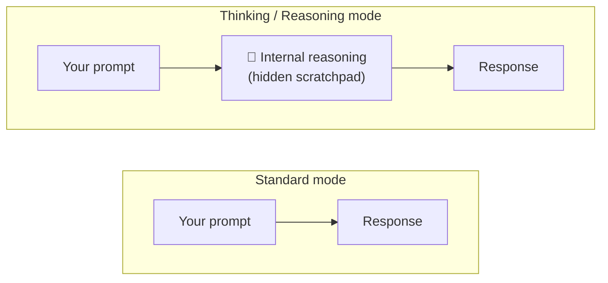
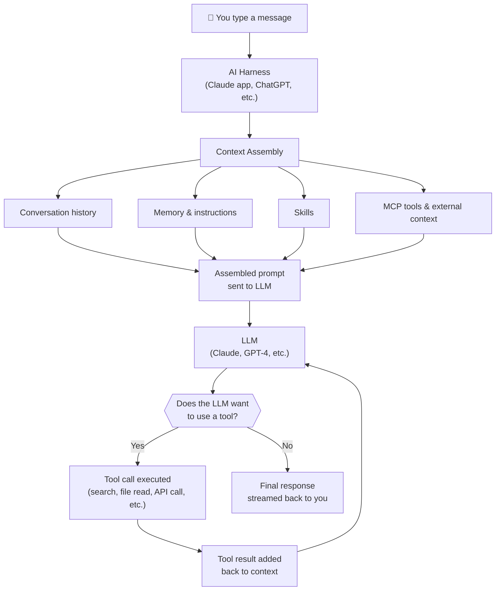
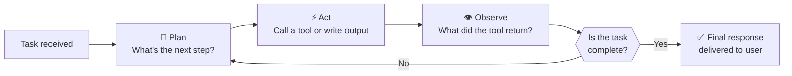
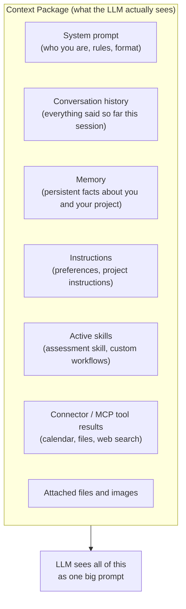
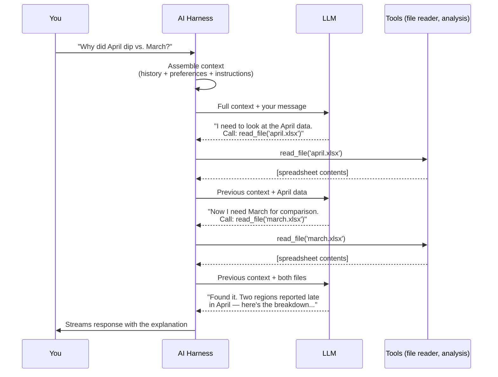
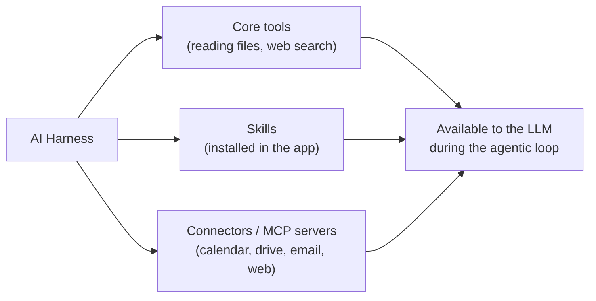

import AssessmentResults from '@site/src/components/AssessmentResults';

# Module 1: How AI Actually Works

*Phase 1 · ~45 minutes · Foundational*

---

## The core idea: next-token prediction

Everything in GenAI comes down to one surprisingly simple task:

> **Given all the text so far, what word (token) comes next?**

That's it. A model trained on hundreds of billions of examples of text learns to make this prediction extremely well. When you send a message to an LLM, it's not "thinking" in the human sense — it's predicting one token at a time, each prediction conditioned on everything that came before.

This is called **autoregressive generation**:

```
Prompt:  "The capital of France is"
Step 1:  "The capital of France is" → predicts → "Paris"
Step 2:  "The capital of France is Paris" → predicts → "."
Step 3:  "The capital of France is Paris." → predicts → (end)
```

This is why models can be slow for long responses — the generation is inherently sequential. It also explains why models sometimes drift or hallucinate — every step is a probabilistic prediction, not a fact lookup.

---

## What is a token?

Models don't see words. They don't see characters. They see **tokens** — chunks of text that average about 3–4 characters in English.

- Common words are usually single tokens: `the`, `is`, `cat`
- Longer or rarer words split into multiple tokens: `unbelievable` → `["un", "believ", "able"]`
- Code and symbols can be unpredictable

**Why it matters:**
- Token count drives **cost** — you pay per token on most APIs
- Token count drives **context window** limits
- Unusual terms (internal product names, niche libraries) may tokenize inefficiently

:::tip Rule of thumb
1 token ≈ ¾ of an English word, or ~4 characters. A 1,000-word document ≈ 1,300 tokens.
:::

**Try it:** Go to [platform.openai.com/tokenizer](https://platform.openai.com/tokenizer) and type the word `strawberry`. Notice how it splits across tokens — this is why models historically struggled to count letters.

---

## Parameters: what "a 70B model" means

When you hear "a 70B model," those 70 billion numbers are called **parameters** (or weights). Think of them as the model's learned knowledge — every relationship, pattern, and fact absorbed during training is encoded across those numbers.

- More parameters → more capacity → generally more capable (up to a point)
- A 7B model can run on a laptop
- A 70B model needs a capable server
- A 400B model needs a cluster

:::info Key insight
The model doesn't "look things up" — knowledge is baked into its weights from training. That's why training is expensive (computing those weights) and inference is much cheaper (just running them).
:::

---

## Vectors: what models think in

Every token gets converted into a **vector** — a list of hundreds or thousands of numbers that encodes meaning geometrically. Similar concepts end up close together in this space.

The classic example: `king − man + woman ≈ queen`

You don't need to know the math. Just know: **models think in vectors, not words.** This becomes important when we talk about embeddings and search in Module 2.

---

## The Transformer

Almost every major LLM uses the same underlying architecture: **the Transformer** (introduced by Google in 2017 with the paper "Attention Is All You Need").

The key innovation is **attention** — a mechanism that lets every token look at every other token to figure out which ones are relevant. This is how the model understands context:

- `"The bank by the **river** was flooded"` — `bank` attends to `river` to resolve meaning
- `"She deposited money at the **bank**"` — `bank` attends to `money` and `deposited`

The mental model: attention is what lets models understand *relationships between words*, not just individual words in isolation.

---

## How models are built

### Pre-training (the expensive part)

The model is shown massive amounts of text — the internet, books, code — and for each piece, tries to predict the next token. When it's wrong, the weights are adjusted. Repeat this trillions of times. This is what costs millions of dollars and takes months.

### Fine-tuning and RLHF (making it useful)

After pre-training, the model can predict text — but it's not "helpful." Fine-tuning on curated examples teaches it to follow instructions. RLHF (Reinforcement Learning from Human Feedback) uses human preferences to teach it what "good" responses look like.

---

## Training vs. Inference

These are completely different operations:

| | Training | Inference |
|--|---------|-----------|
| **What it is** | Computing the model's weights | Running the model to generate a response |
| **Cost** | Enormous (millions of dollars for frontier models) | Cheap per query |
| **Who does it** | Model providers (Anthropic, OpenAI, Google) | You, every time you send a prompt |
| **When it happens** | Once, then periodic updates | Every request |

:::note
When you use Claude, ChatGPT, or any AI app, you're doing *inference* — running a pre-trained model. You're not training anything. Training is what the model providers do.
:::

---

## Thinking and Reasoning modes

Modern AI assistants give you a dial: how much should the model *think* before it answers?

### What "thinking" actually is

Some models (Claude's extended thinking, OpenAI's o1/o3/o4 series, Gemini 2.5 Flash Thinking) can generate **internal reasoning tokens** before producing their final response. Think of it as the model writing out a scratchpad — working through the problem step by step — before committing to an answer.

Those reasoning tokens are usually hidden from you (you see only the final response), but they're real computation happening on the model's side. The model is literally taking more inference steps before answering.

This is different from a standard response, where the model goes directly from input tokens to output tokens in one pass.



### Reasoning effort levels

Most AI tools that expose this feature offer a **reasoning effort** setting:

| Level | What it means | When to use it |
|-------|--------------|----------------|
| **Disabled / Off** | No extended thinking. Standard forward pass. | Quick lookups, simple edits, explaining a concept, formatting tasks |
| **Low** | Minimal thinking budget — a few reasoning steps | Light tasks where you want slightly better accuracy without much extra latency |
| **Medium** | Balanced thinking budget — the default for most models | Day-to-day writing, editing, summarizing, and analysis |
| **High** | Large thinking budget — the model spends significant time reasoning | Complex analysis, multi-step logic, math, planning, anything where accuracy really matters |

:::tip Rule of thumb
Use the lowest level that gives you a good answer. High reasoning is slower and costs more tokens. For most everyday tasks, **the default is right**. Reach for more thinking when you've tried the default and the answer isn't good enough.
:::

### What "thinking disabled" means in practice

When thinking is off, the model is doing a single forward pass: tokens in, tokens out. It's fast, and it's good enough for most tasks. The model still has all its knowledge — it just isn't taking extra steps to reason through the problem.

When thinking is enabled, the model is essentially running the agentic loop *internally*: it plans and reconsiders before locking in its response. This is why reasoning models dramatically outperform standard models on logic puzzles, math, and complex multi-step problems — but offer little benefit on simple factual questions.

### In the Claude app

The **model picker** near the message box lets you see the available models and switch between them — lighter, faster models for everyday tasks, and more capable models for complex or high-stakes work. Some models also expose an **extended thinking** toggle that turns deeper reasoning on for hard problems.

Other AI tools expose the same capability differently — some as a settings toggle, some baked into separate model names. The capability exists either way; only the interface differs. (Hands-on model advice comes in [Phase 2, Module 1](/docs/phase-2/claude-essentials#choosing-a-model).)

:::info The cost of thinking
Extended thinking tokens count against your token budget just like regular tokens. A high-reasoning response might consume 5–10× more tokens than a standard one. For high-volume tasks, keep this in mind.
:::

---

## What happens when you send a prompt

At the LLM level, it's simple: tokens in, tokens out. But the tooling wrapped around that LLM — the **AI harness** — does a lot of heavy lifting before your prompt even reaches the model.



The LLM itself only does one thing: given tokens in, predict tokens out. Everything else — pulling context, calling tools, routing results back — happens in the harness.

---

## The Agentic Loop

When an AI assistant completes a multi-step task (fixing a bug, writing a feature, investigating an error), it doesn't do it in one shot. It runs an **agentic loop** — a cycle of planning, acting, and observing until the task is done.



Each iteration the model:
1. **Plans** — decides what to do next based on the goal and what it's learned so far
2. **Acts** — calls a tool (reads a file, runs a search, executes a command) or produces output
3. **Observes** — reads the result and updates its understanding

This is why Claude can say "let me look at the spreadsheet you attached first" and then pivot based on what it finds. It's not a single inference — it's many inferences looped together.

---

## What the harness assembles: context in depth

When you type a message, the harness doesn't just forward your words to the LLM. It builds a **prompt package** from multiple sources:



The LLM has **no memory between sessions** on its own — the harness creates the illusion of memory by injecting stored facts into every prompt. The LLM has **no ability to take actions** on its own — the harness executes tool calls on behalf of the LLM and feeds results back.

The harness also manages the context window's fixed budget: when a long conversation outgrows it, most apps quietly **compact** — they summarize older turns and keep going with the summary. The conversation continues, but early details fade to whatever made it into the summary. (This explains a lot of everyday behavior — see [chat hygiene in Phase 2](/docs/phase-2/claude-essentials#when-to-start-a-new-chat).)

:::info The model doesn't know what time it is
Unless the harness injects it. The model doesn't know your name, your company, or how your team likes things formatted — unless those are in the context window. This is why good context hygiene (preferences, project instructions, attached material) makes AI dramatically more useful.
:::

---

## A real-world walkthrough

**Scenario:** You attach two spreadsheets to a Claude chat and type: *"Why did our April numbers dip compared to March?"*

Here's what actually happens:



Notice what happened:
- You wrote one sentence
- The LLM was called **three times**
- Two file reads happened in between
- Each LLM call got the full accumulated context
- You saw one seamless response

This is the agentic loop in action.

---

## Where skills and connectors fit in

**Skills and connectors** are how the harness gets extended. They register additional **tools** and knowledge the LLM can use during its agentic loop.



This course's assessment skill is exactly this: packaged instructions loaded into the harness that the LLM applies when you ask to be assessed. The LLM decides *when* to use it based on your message — it's not hardcoded to a keyword. (You'll install it in [Phase 2, Module 4](/docs/phase-2/connectors-and-skills#installing-a-skill).)

:::tip What this means for you
Every connector, skill, or instruction you add to your setup is expanding what the LLM can *perceive* and *do*. A well-configured setup isn't just convenience — it changes what's possible.
:::

---

## Hands-on exercise

1. Go to [platform.openai.com/tokenizer](https://platform.openai.com/tokenizer)
2. Type a regular English sentence — count the tokens vs. the words
3. Type some code — notice how it tokenizes differently than prose
4. Type a long technical term from your work — how many tokens?
5. Type `strawberry` — can you see why models struggle with "how many r's?"

---

## Vocabulary

| Term | What it means |
|------|--------------|
| **LLM** | Large Language Model — any of the major AI models (GPT, Claude, Gemini, etc.) |
| **Token** | The unit models work in — roughly ¾ of a word |
| **Parameter / Weight** | A learned number in the model; "70B" = 70 billion parameters |
| **Transformer** | The architecture almost all major LLMs use |
| **Attention** | The mechanism that lets tokens relate to each other |
| **Vector / Embedding** | How meaning is represented numerically inside the model |
| **Pre-training** | Initial, expensive training on massive text data |
| **Fine-tuning** | Further training to make the model useful and safe |
| **RLHF** | Reinforcement Learning from Human Feedback — teaching the model what "good" looks like |
| **Training** | Computing the model's weights — what providers do |
| **Inference** | Running the model — what happens every time you send a prompt |
| **Autoregressive** | Generating one token at a time, each conditioned on the previous ones |
| **AI Harness** | The orchestration layer between you and the LLM — assembles context, runs tools, manages the loop |
| **Agentic Loop** | Plan → Act → Observe → repeat — how AI assistants handle multi-step tasks |
| **Context Window** | The total amount of text the LLM can see at once (your input + history + injected context) |
| **Tool Call** | When the LLM instructs the harness to run an action (read a file, call an API, etc.) |
| **Skill** | Packaged instructions and tools added to the harness, expanding what the LLM can do |
| **MCP** | Model Context Protocol — a standard for connecting external services as LLM tools |
| **Thinking / Extended Thinking** | Internal reasoning tokens the model generates before its final response — not shown to the user |
| **Reasoning Effort** | A dial (low / medium / high) controlling how much internal thinking the model does before answering |

---

## Key takeaways

1. **Everything is next-token prediction.** Even complex reasoning is this simple idea, done extremely well at massive scale.
2. **Tokens ≠ words.** Think in tokens when reasoning about cost and context limits.
3. **Parameters = learned knowledge.** Model size roughly correlates to capability, but bigger isn't always necessary.
4. **Training ≠ inference.** Your team runs inference. The model provider does training.
5. **The Transformer and attention** are what make context and relationships work.
6. **The LLM sees only what the harness puts in front of it.** Memory, instructions, skills, and tool results are all assembled by the harness — the LLM has no independent access to any of it.
7. **The agentic loop** is how multi-step tasks work: plan, act, observe, repeat. Each loop iteration is a separate LLM inference.
8. **Context is everything.** Well-configured memory, instructions, and skills aren't just convenience — they fundamentally change what the LLM can perceive and accomplish.
9. **Thinking and reasoning effort** are a dial you can control. Higher reasoning effort = more internal thinking steps = better accuracy on complex tasks, but slower and more expensive. Use medium as your default; reach for high on hard problems.

---

*Next: [Module 2 — Using AI Effectively](./using-ai-effectively)*

---

## Module 1 Self-Assessment

<AssessmentResults moduleNumber={1} phase={1} moduleInPhase={1} />
