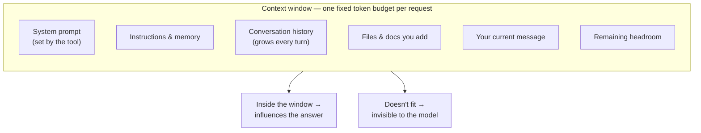
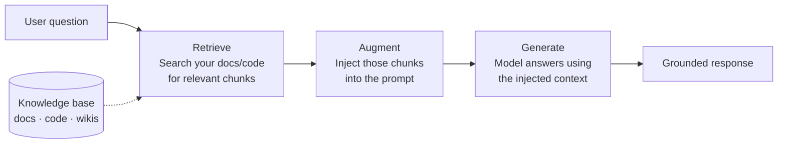

import AssessmentResults from '@site/src/components/AssessmentResults';

# Module 2: Using AI Effectively

*Phase 1 · ~45 minutes · Practical techniques*

---

## The context window

Every model has a **context window** — the total amount of text it can "see" at once. Think of it as the model's working memory. Everything inside the window influences the response. Everything outside it doesn't exist.

The context window includes everything: your message, system instructions, conversation history, and any documents you've provided.

| Model | Context window | ~Words |
|-------|---------------|--------|
| GPT-4o | 128K tokens | ~96K words |
| Claude Sonnet 4.6 | 200K tokens | ~150K words |
| Gemini 2.5 Pro | 1M tokens | ~750K words |
| Smaller / local models | 4K–128K tokens | — |

:::note Models change fast
These figures were current as of mid-2025 — context windows and model generations update frequently. Check the provider's current docs for the latest numbers. The relative ordering (local < GPT-4o/Sonnet < Gemini) is the stable mental model; the exact numbers shift.
:::

**What this means in practice:**

- You can include large files, long docs, full conversation history — up to the limit
- Past the limit, the model literally cannot see that content
- More context ≠ better results: models are less reliable on content buried in the middle of very long contexts (the "lost in the middle" problem)
- Bigger context = higher cost; be intentional about what you include

Everything competes for the same fixed budget on every request:



---

## Anatomy of a prompt

Every interaction with an LLM has these components:

```
┌──────────────────────────────────────────────┐
│  SYSTEM PROMPT                               │
│  Instructions set by the product/tool        │
│  (usually hidden from you)                   │
├──────────────────────────────────────────────┤
│  CONVERSATION HISTORY                        │
│  [previous messages, if any]                 │
├──────────────────────────────────────────────┤
│  YOUR MESSAGE                                │
└──────────────────────────────────────────────┘
```

The **system prompt** is how tools like Copilot and ChatGPT shape the model's behavior before your message arrives. This is why the same underlying model behaves differently in different products.

---

## Prompt engineering techniques

### Zero-shot vs. few-shot

**Zero-shot:** just ask. No examples.
```
"Summarize this meeting transcript in 3 bullet points."
```

**Few-shot:** show the model what "good" looks like with examples before your actual request.
```
"Here's the format I want:

Input: [meeting transcript]
Output:
• Decision made: ...
• Action items: ...
• Open questions: ...

Now summarize this transcript: [your transcript]"
```

:::tip
A couple of good examples beats paragraphs of instructions. When zero-shot keeps missing the mark, try few-shot.
:::

### Chain-of-thought

For complex reasoning, ask the model to think step by step:

```
❌  "What's the best database architecture for this use case?"

✅  "Walk me through the tradeoffs of different database
    architectures for this use case, then give me your
    recommendation."
```

When the model writes out its reasoning, it's more likely to catch errors in its own logic. Use this for architecture decisions, debugging, and any task where you want the reasoning visible — not for simple lookups or boilerplate.

### Temperature

Temperature controls how random the model's output is:

| Temperature | Behavior | Use when |
|-------------|----------|----------|
| 0.0 | Always picks the highest-probability token | Code generation, data extraction, factual Q&A |
| 0.7 | Balanced | General assistance, summaries |
| 1.0+ | More random, sometimes surprising | Brainstorming, creative writing |

---

## Hallucination

This is the most important reliability concept in AI.

> **Hallucination:** The model confidently states something that is false.

It's not "lying" — the model has no concept of truth. It's predicting the next most-likely token, and sometimes the most statistically likely token is wrong. The model can't distinguish between things it "knows" and things it's fabricating.

**Classic examples:**
- Fabricated API method names that don't exist
- Made-up citations with plausible-looking details
- Incorrect dates, version numbers, statistics
- Confident but wrong answers to niche technical questions

### Why it happens

Connecting back to Module 1: next-token prediction selects statistically probable continuations — not factually correct ones. These are usually the same for common knowledge, but diverge for:
- Niche topics with sparse training data
- Very specific numbers (dates, version numbers)
- Questions at the edge of what the model knows

### Managing it

| Risk level | Examples | Approach |
|------------|---------|---------|
| **High** | Specific API docs, citations, legal/medical claims, version numbers | Always verify; provide source material |
| **Medium** | Architecture decisions, technical recommendations | Use chain-of-thought; verify key claims |
| **Low** | Summarizing text you provided, reformatting, well-known patterns | Generally reliable |

---

## The grounding principle

The single most effective way to reduce hallucination:

> **Don't ask the model to recall. Give it the information and ask it to reason.**

```
❌  "What are the rate limits for our internal API?"

✅  "Here is the API documentation: [paste docs]
    What are the rate limits?"
```

When the model has the source material in its context window, it's summarizing and reasoning — not recalling from training. This is dramatically more reliable. This principle is the foundation of RAG.

---

## RAG: Retrieval-Augmented Generation

RAG is the dominant pattern for grounding AI in real, current, or private knowledge:



The model reads the documents you inject — it's not recalling from training data. This makes it far more accurate for questions about your specific codebase, internal docs, or any data that changes.

### RAG vs. alternatives

| Approach | Good for | Not ideal for |
|----------|----------|--------------|
| **Just ask** | General knowledge, reasoning | Specific current facts, private data |
| **RAG** | Private docs, up-to-date knowledge, precise facts | Real-time data (still has a retrieval step) |
| **Fine-tuning** | Teaching style/behavior | Teaching factual knowledge reliably |
| **Bigger context** | More in scope at once | Always having the *right* thing in context |

**Rule of thumb:** Questions about your private data or anything that changes → use RAG. General concepts and reasoning → prompting alone is usually enough.

---

## Memory in AI systems

LLMs have no memory between conversations. Every call starts completely fresh.

| Type | How it works | Examples |
|------|-------------|---------|
| **Short-term (in-context)** | Previous messages included in each prompt | All chat interfaces |
| **Medium-term (files)** | Model reads/writes files as persistent notes | Copilot CLI, Claude Code |
| **Long-term (vector DB)** | Past interactions embedded and retrieved by meaning | ChatGPT memory feature |

:::note
When you start a new chat with any AI tool, it doesn't remember your last conversation — unless the product explicitly implements a memory mechanism. The statelessness is a feature of the model, not a bug.
:::

---

## Hands-on exercise: four-way comparison

Take one real task from your work. Solve it four ways:

1. **Zero-shot** — just ask directly
2. **Few-shot** — give 2–3 examples of what you want before asking
3. **Chain-of-thought** — ask it to reason step by step first
4. **With context** — paste in the relevant doc or code, then ask

Compare the quality of responses. Notice which approach works best for which type of task.

---

## Vocabulary

| Term | What it means |
|------|--------------|
| **Context window** | Total text a model can see at once — its working memory |
| **System prompt** | Pre-set instructions from the tool/product, before your message |
| **Zero-shot** | Asking without examples |
| **Few-shot** | Providing examples before your request |
| **Chain-of-thought** | Asking the model to reason step by step |
| **Temperature** | How random/creative the model's output is |
| **Hallucination** | When a model confidently states something false |
| **Grounding** | Providing source material so the model reasons from fact, not recall |
| **RAG** | Retrieval-Augmented Generation — search + inject + generate |
| **Embedding** | A vector representation of text, used for semantic search |
| **Vector database** | Where embeddings are stored for fast similarity search |
| **Memory** | How AI systems persist state across turns/sessions |

---

## Key takeaways

1. **Context window = working memory.** If it's not in the window, the model doesn't know it.
2. **Few-shot beats long instructions.** Show examples, don't just describe.
3. **Hallucination is structural, not a bug.** Manage it by grounding the model in provided context.
4. **RAG is the dominant production pattern** for questions about specific, current, or private data.
5. **AI has no memory by default.** State persistence is something applications implement on top.

---

*Next: [Module 3 — AI in Your Engineering Workflow](./ai-in-your-workflow)*

---

## Module 2 Self-Assessment

<AssessmentResults moduleNumber={2} phase={1} moduleInPhase={2} />
